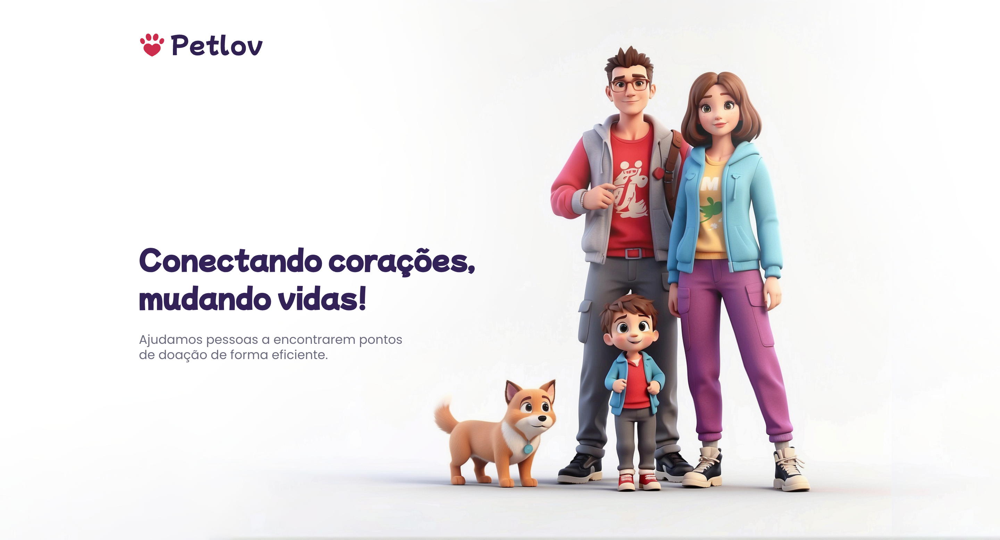

# 🐶 Petlov

## 🚀 Sobre o Projeto

O **Petlov** é um aplicativo web desenvolvido para **cadastro de pontos de doação de pets**, criado exclusivamente para os alunos do **Curso Ninja do Cypress**, ministrado pelo **Fernando Papito**! 🥷💻

Este projeto serve como ambiente prático para aprendizado e aplicação de técnicas avançadas de automação de testes com Cypress, proporcionando uma experiência real de desenvolvimento e teste de aplicações web modernas.

### 🎯 Objetivos Pedagógicos

- Praticar automação de testes end-to-end com Cypress
- Integrar Github Actions com Cypress Cloud

## 🛠️ Tecnologias Utilizadas

### Desenvolvimento & Testes
- [x] Git & GitHub 🌍 (Controle de versão e repositório remoto)
- [x] Cypress 🧪 (Framework de testes end-to-end)
- [x] Cypress Cloud ☁️ (Dashboard e relatórios de testes)
- [x] GitHub Actions 🔄 (Integração contínua)

## 📖 Como Usar

### 🎓 Para Alunos do Curso

As instruções detalhadas de instalação, configuração e uso do **Petlov** estão disponíveis dentro da plataforma do **Curso Ninja do Cypress**.

🔗 **Acesse o curso e seja Ninja da Automação em Cypress!** 👉 [ninjadocypress.com.br](https://ninjadocypress.com.br)

## 💬 Suporte

### 📞 Canais Oficiais

Para suporte técnico e esclarecimento de dúvidas, utilize exclusivamente os **canais oficiais do Curso Ninja do Cypress**:

- 💬 **Fórum do Curso**: Discussões e dúvidas técnicas
- 📧 **Suporte Direto**: Atendimento personalizado
- 📱 **Comunidade**: Networking e troca de experiências

### 🚫 Importante

Dúvidas técnicas **não** devem ser direcionadas para repositórios públicos ou outros canais não oficiais.

## ⚠️ Contribuição

O **Petlov** é um ambiente educacional **exclusivo** para os alunos do **Curso Ninja do Cypress**. Por questões pedagógicas e de controle de qualidade, este projeto **não aceita contribuições externas**.

### 🎓 Para Alunos

- Utilize o projeto conforme orientações do curso
- Compartilhe experiências nos canais oficiais
- Contribua com discussões construtivas na comunidade

## 🔒 Licença

Este projeto é **propriedade exclusiva** do **Curso Ninja do Cypress** e seus respectivos autores.

### ⚖️ Termos de Uso

- 🎓 **Uso Educacional**: Limitado aos alunos matriculados no curso
- 🚫 **Redistribuição Proibida**: Compartilhamento não autorizado é vedado
- 📝 **Direitos Autorais**: Todos os direitos reservados
- 🔐 **Confidencialidade**: Mantenha o conteúdo restrito ao ambiente do curso

---

## 👨‍💻 Autor

**Fernando Papito**  
*Especialista em Automação de Testes e Cypress*

📧 **Contato Profissional**: Através dos canais oficiais do curso  
🌐 **Site Oficial**: [ninjadocypress.com.br](https://ninjadocypress.com.br)

---

💙 **Desenvolvido com dedicação, muito café e paixão por ensinar** ☕  
🚀 **Curso Ninja do Cypress** - *Transformando desenvolvedores em ninjas da automação* 🥷

---

> 💡 **Dica**: Aproveite ao máximo este projeto! Ele foi cuidadosamente desenvolvido para acelerar seu aprendizado em automação de testes com Cypress. Explore, pratique e torne-se um verdadeiro ninja! 🥋✨